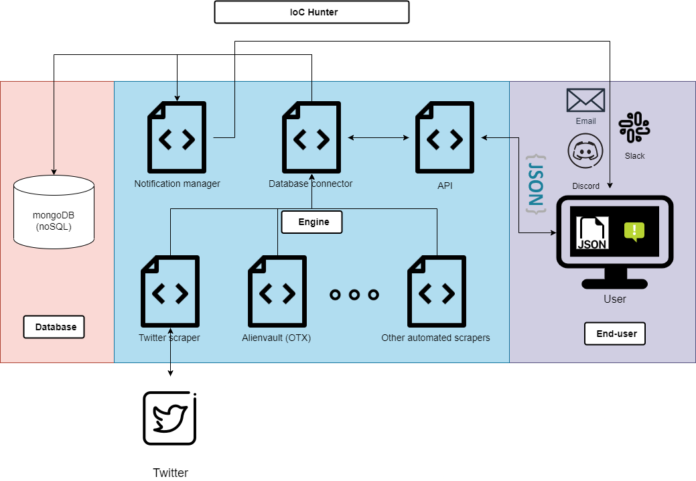

# IoC Hunter 🌐🔍

IoC Hunter is a powerful, user-friendly tool designed to identify and investigate Indicators of Compromise (IoCs) social media platforms (e.g., Twitter, Mastodon, and others). This tool helps security analysts, threat hunters, and IT administrators to detect, analyze, and mitigate potential security threats in a timely manner. 

## Table of Contents 📚

- [IoC Hunter 🌐🔍](#ioc-hunter-)
  - [Table of Contents 📚](#table-of-contents-)
  - [Features 🌟](#features-)
  - [Architecture 📃](#architecture-)
  - [Installation 🛠️](#installation-️)
    - [Requirements](#requirements)
    - [Steps](#steps)
    - [Customization](#customization)
    - [Run](#run)
  - [Demo 👨‍💻](#demo-)
  - [Contribution 🤝](#contribution-)
  - [License ⚖️](#license-️)
  - [Credits 🙌](#credits-)

## Features 🌟

- Robust IoC collection and extraction
- Supports multiple social media platfroms as plugins 
- API endpoint to query all collected IoCs for further integration
- Extensible and modular architecture
- Utiltiz regex to customize findings based on orgnization's needs 
- Real-time notification via Discord webhooks 

## Architecture 📃
The proposed solution aims to create an application with three main goals: a centralized database for storing IoCs, a notification manager for real-time updates, and an API for sharing IoCs in JSON format. A NoSQL database is chosen for its flexibility, scalability, and JSON compatibility. The engine architecture has three components: notification manager, database connector, and API, along with an automated scraper for efficient IoC collection and extraction. The end-user experience is user-friendly, with a simple API interaction and customizable notifications via Slack, Discord, or email.

  Figure 1: Architecture of IoC Hunter

  Figure 2: Workflow of IoC Hunter
## Installation 🛠️

### Requirements

- Docker (for installation please refer to: https://docs.docker.com/engine/install/)

### Steps

1. Clone the repository
2. Navigate to the project directory

### Customization
1. Make a copy of .env.example (name it .env,) and add any needed information 
2. Customize twitter/twitter_keywords and/or mastodon_impl/mastodon_keywords to customize the search terms

### Run
1. Run Docker compose: `$ docker compose up -d` 
2. API documentation cloud be found at http://localhost:8000/docs
   * Every collector will store its collected IoCs in a NoSQL collection nameed with the platform's name (e.g., Twitter collector will save IoCs in a collection called Twitter) 

That's it! You're ready to use IoC Hunter.
## Demo 👨‍💻

    Figure 3: Demo of IoC Hunter

## Contribution 🤝

We welcome contributions from the community! If you'd like to contribute to IoC Hunter, please follow these steps:

1. Fork the repository
2. Create a new branch (`git checkout -b feature_branch`)
3. Commit your changes (`git commit -am 'Add a new feature'`)
4. Push to the branch (`git push origin feature_branch`)
5. Create a Pull Request

## License ⚖️

This project is licensed under the MIT License. See the [LICENSE](LICENSE) file for more information.

## Credits 🙌

IoC Hunter is developed and maintained by [Abanaser](https://github.com/Abanaser).

A special thanks to the open-source community for their invaluable support, resources, and inspiration!
